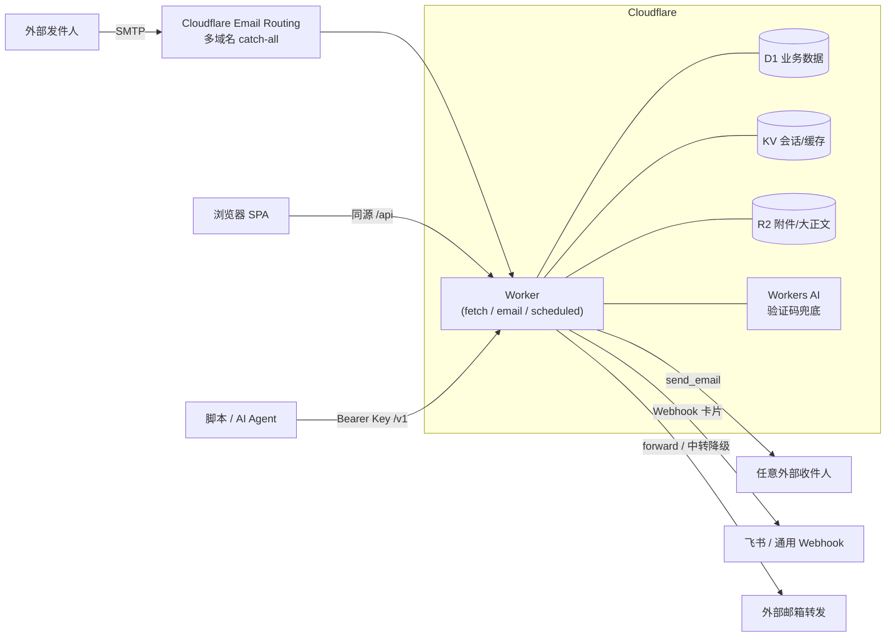

<p align="center">
  
</p>

<h1 align="center">HPC Mail</h1>

<p align="center">
  <b>基于 Cloudflare Workers 的多域名多用户邮箱系统</b>
  <br />
  不需要传统邮件服务器：Email Routing 收件 + Workers 处理 + D1/KV/R2 存储，push 到 main 即自动部署。
</p>

<p align="center">
  <a href="https://github.com/riba2534/hpc-mail/actions/workflows/deploy.yml"></a>
  <a href="https://workers.cloudflare.com/"></a>
  <a href="https://react.dev/"></a>
  
  <a href="https://github.com/riba2534/hpc-mail/stargazers"></a>
  <a href="LICENSE"></a>
</p>

<p align="center">
  <a href="#hpc-mail-是什么">介绍</a> ·
  <a href="#功能总览">功能</a> ·
  <a href="#面向-ai-agent-设计">AI Agent</a> ·
  <a href="#系统架构">架构</a> ·
  <a href="#快速开始">快速开始</a> ·
  <a href="#部署到-cloudflare">部署</a> ·
  <a href="#开放-api">开放 API</a> ·
  <a href="#运维">运维</a> ·
  <a href="#faq">FAQ</a>
</p>

---

## HPC Mail 是什么

HPC Mail 是一个完全跑在 Cloudflare 上的邮箱系统。它用 **Email Routing（收件）+ Workers（处理）+ D1 / KV / R2（存储）+ Workers AI（验证码兜底）** 组合出完整的多域名、多用户邮件服务——没有 SMTP 服务器要维护，没有 VPS 要续费，日常用量基本落在 Cloudflare 免费额度内。

把任意多个域名的 catch-all 指向它，**任何前缀的地址都即收即用**：`abc@your-domain.com`、`x123@another.com` 不需要预先创建，来信全部落库。用户「认领」一个地址后即可用它收发；系统自动从来信里提取验证码；全套能力同时通过网页和开放 REST API 提供——后者配有一份专门写给 AI Agent 的操作指南，让 Claude / GPT 之类的 Agent 拿到用户名密码就能自己收发邮件、读验证码。

### 为什么选择 HPC Mail

- **零服务器** — 收发、存储、前端托管全部在 Cloudflare 上，部署完成后没有任何需要运维的进程
- **任意前缀 catch-all** — 不用预建邮箱，注册网站时现编一个地址就能收到信；接码场景开箱即用
- **验证码自动提取** — 正则同步提取 + Workers AI 兜底，列表角标、详情高亮、一键复制，API 里直接给 `verificationCode` 字段
- **多域名 + 多用户** — 域名由管理后台动态维护（加域名不用重新部署）；地址认领制，全局唯一，认领即可见该地址全部历史邮件
- **完整收发** — 回复线程化（In-Reply-To/References）、转发、CC/BCC、附件；外发走 Cloudflare `send_email`，可发送任意外部地址
- **转发与通知到你常用的地方** — 每个用户独立配置：转发到任意外部邮箱（原生转发失败自动降级中转重发，带防环路守卫）、推送飞书卡片、回调通用 Webhook（Bark / ntfy / 自建）
- **AI Agent 原生** — `/skill.md` 是一份部署在站点上的 Agent 操作说明书，`/v1/openapi.json` 提供 OpenAPI 3.1 描述
- **push 即部署** — 一条 GitHub Actions 流水线：测试门控 → 构建 → 数据库迁移 → 部署 → 迁移完整性校验 → 线上冒烟

## 功能总览

| 模块 | 主要能力 |
| --- | --- |
| **收件** | 多域名 catch-all、大正文自动落 R2、附件存 R2、失败隔离（只有落库失败才触发 SMTP 重试） |
| **收件箱** | 全域名混排，按域名 / 地址 / 已读未读 / 星标 / 关键词（含正文）过滤，状态同步到 URL |
| **验证码** | 正则同步提取 + Workers AI 兜底（可开关），角标展示与一键复制 |
| **发件** | 回复 / 转发 / CC / BCC / 附件，站内互投即时落库，外发配额可配 |
| **转发通知** | 按「收件地址归属人」分流的个人偏好：邮箱转发（含中转降级）、飞书 Webhook 卡片（HMAC 签名 + 防 SSRF）、通用 Webhook |
| **多用户** | admin / user 两角色；注册模式默认关闭（可开邀请码/开放）；地址认领制；域名可设「仅管理员」或开放认领，可按域名限制每人认领数 |
| **开放 API** | `/v1` 全套接口，API Key 支持 scope、每分钟限流、IP 白名单、过期时间与调用审计 |
| **账户安全** | JWT + KV 会话、改密 / 禁用即时踢线、TOTP 两步验证（可全局强制）、新 IP 登录飞书告警 |
| **管理后台** | 注册模式（关闭 / 邀请码 / 开放）、域名管理、保留策略、外发配额、用户管理（含查看每人绑定邮箱） |

## 面向 AI Agent 设计

这是 HPC Mail 与传统 webmail 最大的差异点：它把「让 AI 替你收发邮件」当成一等公民。

- **`/skill.md`** — 部署后站点根路径直接提供一份按 Agent Skill 标准写的 API 操作指南，AI 拿到用户名密码即可照着完成登录、认领地址、收信、读验证码、发信、回复全流程
- **`/v1/openapi.json`** — OpenAPI 3.1 描述，server 地址按你的部署域名自动生成，可直接导入任何 API 工具
- **`verificationCode` 字段** — 接码不需要 AI 解析正文，收件列表和详情接口直接返回提取好的验证码

```bash
# AI Agent 的典型一轮：登录 → 收最新邮件 → 拿验证码
TOKEN=$(curl -s -X POST $BASE/api/auth/login -H 'Content-Type: application/json' \
  -d '{"username":"bot","password":"***"}' | jq -r .data.token)
curl -s "$BASE/api/messages?limit=1" -H "Authorization: Bearer $TOKEN" \
  | jq -r '.data.items[0].verificationCode'
```

用法很简单：**把 `https://你的域名/skill.md` 这个链接直接丢给你的 AI Agent**（Claude、GPT 等），再给它一个账号的用户名密码，它就会照着文档自己完成收发邮件、读验证码的全部操作。

## 系统架构



单个 Worker 同时承载三个入口：`fetch`（`/api` 内部接口 + `/v1` 开放接口 + 前端静态资源）、`email`（Email Routing catch-all 收件）、`scheduled`（每日清理）。前端构建产物打进 Worker Assets **同源部署**，`/api` 请求零跨域。

前后端靠 `packages/shared` 的 zod schema 共享契约：worker 用它校验输入，web 用它做表单前置校验并导入响应类型，改接口只改一处。

## 技术栈

| 层 | 技术 |
| --- | --- |
| 后端 | Cloudflare Workers · Hono 4 · Drizzle ORM（D1/SQLite 增量迁移）· PostalMime |
| 前端 | React 19 · Vite · Tailwind CSS 4 · TanStack Query 5 · React Router 7 · Radix Primitives |
| 契约 | pnpm workspace monorepo，`packages/shared` 提供前后端共享的 zod schema 与类型 |
| 存储 | D1（业务数据）· KV（会话/配置缓存）· R2（附件与超大正文） |
| CI/CD | GitHub Actions：测试门控 → 构建 → 资源注入 → 迁移 → 部署 → 完整性校验 → 线上冒烟 |

## 快速开始

### 本地开发

```bash
pnpm install
cp apps/worker/.dev.vars.example apps/worker/.dev.vars   # 填 jwt_secret
pnpm --filter @hpc-mail/worker db:migrate:local          # 初始化本地 D1
ADMIN_USERNAME=admin ADMIN_PASSWORD=your-password-12chars \
  node apps/worker/scripts/seed-admin.mjs --local        # 引导本地管理员
pnpm dev                                                 # worker :8787 + web :3002
```

本地无需真实收信，用内置脚本注入一封测试邮件（域名先在后台「域名」页添加）：

```bash
apps/worker/scripts/dev-send-mail.sh otp-plain hello@example.com
```

> `wrangler dev` 依赖 workerd，宿主机需要 glibc ≥ 2.32（Ubuntu 22.04+）。worker 集成测试同理，本地跑不了时以 CI 结果为准，详见 [CONTRIBUTING.md](CONTRIBUTING.md)。

### 部署到 Cloudflare

三种方式：**让 AI Agent 帮你部署**（推荐，动嘴不动手）、**一键部署按钮**（最快见效，先跑在 workers.dev）、或**手动配置 GitHub Actions**。三种方式都**不需要改仓库里的任何文件**。

#### 方式一：让 AI Agent 帮你部署（推荐）

把下面整段提示词复制给你的 AI 编程助手（Claude Code、Codex、Cursor 等，需要能执行终端命令），它会替你完成 fork、建资源、配置到上线的全过程，只在关键节点（域名、管理员账号、API Token）向你要输入：

```text
请帮我把开源邮箱系统 HPC Mail（https://github.com/riba2534/hpc-mail）部署到我自己的
Cloudflare 账号，走 GitHub Actions 持续部署。逐步执行，每步验证成功再继续：

1. 环境检查：gh auth status 确认 GitHub CLI 已登录；wrangler whoami 确认 wrangler
   已安装并登录（缺哪个就先引导我装好/登录）。
2. Fork 并克隆：gh repo fork riba2534/hpc-mail --clone，进入仓库目录。
3. 通读 README「方式三：手动配置 GitHub Actions」一节并照做——那里有完整的资源创建
   命令、8 项 Secrets/Variables 清单和 API Token 权限配方，以下步骤是它的执行摘要。
4. 创建资源并记录输出的 ID：
   wrangler d1 create hpc-cloud-mail-db
   wrangler kv namespace create kv
   wrangler r2 bucket create hpc-cloud-mail-r2
   （R2 未激活会失败——提示我去 Cloudflare 控制台激活 R2 后重试。）
5. 向我收集三样东西：站点域名 CUSTOM_DOMAIN（必须已托管在我的 Cloudflare 账号且
   Active）、管理员用户名（3-32 位小写字母/数字）、管理员密码（12 位以上）。
   JWT_SECRET 不用问我，用 openssl rand -base64 32 | tr '+/' '-_' | tr -d '=' 生成。
6. 引导我创建 CLOUDFLARE_API_TOKEN：控制台用「Edit Cloudflare Workers」模板，再手动
   加 Account→D1:Edit 和 Zone→Workers Routes:Edit（Zone Resources 勾选 CUSTOM_DOMAIN
   所在 zone），创建后我把 token 粘给你。
7. 写入配置（在 fork 出的仓库上执行）：gh secret set 三项（CLOUDFLARE_API_TOKEN /
   JWT_SECRET / ADMIN_PASSWORD），gh variable set 五项（CLOUDFLARE_ACCOUNT_ID 用
   wrangler whoami 查、D1_DATABASE_ID / KV_NAMESPACE_ID 用第 4 步的输出、
   CUSTOM_DOMAIN / ADMIN_USERNAME 用第 5 步收集的值）。
8. 启用 fork 仓库的 Actions（gh workflow enable deploy.yml，不行就引导我在仓库
   Actions 页点启用），然后 gh workflow run "Deploy HPC Mail" 触发首次部署
   （全新数据库不要开 reset_database）。
9. gh run watch 盯到全部步骤通过。若「线上冒烟」超时，多半是 custom domain 证书
   还在签发，等一分钟重跑（不要勾 reset_database）。
10. 部署成功后：指导我在 Cloudflare 控制台给收件域名开 Email Routing 并把 catch-all
    指向 hpc-cloud-mail Worker；然后让我登录 https://<CUSTOM_DOMAIN>，用管理员账号
    进「管理后台 → 域名」添加域名；最后往任意前缀@该域名发一封测试邮件，确认收件箱
    能收到才算完成。

要求：密码和 token 不要回显到输出里；任何一步失败，按 README FAQ 的「部署失败怎么
排查」给出具体原因和修复建议后再重试。
```

#### 方式二：一键部署（试验性）

[](https://deploy.workers.cloudflare.com/?url=https://github.com/riba2534/hpc-mail)

点击按钮后 Cloudflare 会：把仓库克隆到你的 GitHub → 自动创建 D1 / KV / R2 / Workers AI 资源并写入配置 → 引导你填入 `jwt_secret` → 构建并部署到 `*.workers.dev`，之后 push 到你的克隆仓库即由 Workers Builds 持续部署。

部署完成后还差三步：

1. **创建管理员**：克隆你的新仓库，`wrangler login` 后执行
   `ADMIN_USERNAME=admin ADMIN_PASSWORD=你的密码 node apps/worker/scripts/seed-admin.mjs`
2. **接入收件域名**：照方式三的第 4 步「接入收件域名」操作（各方式此步相同）
3. （可选）**绑定自有域名**：Workers 控制台 → 你的 Worker → Settings → Domains & Routes

> 标注试验性的原因：官方按钮对 monorepo 支持有限。若流程中要求填构建配置，构建命令填 `pnpm build`、部署命令填 `pnpm run deploy`；走不通就用方式一或方式三。克隆出的仓库自带方式三的 Actions 工作流，未配置 Variables 时会自动跳过，不会红叉。

#### 方式三：手动配置 GitHub Actions

fork 后全部账户差异通过 GitHub Secrets / Variables 注入。

**前置条件**（README 之外不需要再摸索别的）：

- 本地安装并登录 wrangler：`npm i -g wrangler && wrangler login`
- `CUSTOM_DOMAIN` 要用的域名已**添加进你的 Cloudflare 账号且状态为 Active**——CI 部署会关闭 `workers_dev`，这个域名就是站点唯一入口
- R2 已在控制台激活（首次开通可能需要绑定支付方式）
- 账户 ID 的位置：Cloudflare 控制台任意域名的概览页右侧「Account ID」

**1. 创建资源**（D1/R2 名字必须与命令完全一致；KV 的名字随意，起作用的是输出的 id）：

```bash
wrangler d1 create hpc-cloud-mail-db      # 记下输出的 database_id
wrangler kv namespace create kv           # 记下输出的 namespace id
wrangler r2 bucket create hpc-cloud-mail-r2
```

**2. 配置 GitHub 仓库 Secrets / Variables**：

| 类型 | 名称 | 说明 |
| --- | --- | --- |
| Secret | `CLOUDFLARE_API_TOKEN` | 权限见下方说明 |
| Secret | `JWT_SECRET` | 生成：`openssl rand -base64 32 \| tr '+/' '-_' \| tr -d '='` |
| Secret | `ADMIN_PASSWORD` | 管理员密码（12–128 位） |
| Variable | `CLOUDFLARE_ACCOUNT_ID` | Cloudflare 账户 ID |
| Variable | `D1_DATABASE_ID` | 第 1 步输出的 D1 ID |
| Variable | `KV_NAMESPACE_ID` | 第 1 步输出的 KV ID |
| Variable | `CUSTOM_DOMAIN` | 站点域名（Worker custom domain，不含 `https://`） |
| Variable | `ADMIN_USERNAME` | 管理员用户名（3–32 位小写字母/数字/`-`/`_`） |

> **API Token 权限**：用「Edit Cloudflare Workers」模板创建，再手动补两条——**Account → D1:Edit**（模板不含）、**Zone → Workers Routes:Edit** 且 Zone Resources 勾选 `CUSTOM_DOMAIN` 所在 zone（缺这条会在「部署 Worker」步骤失败）。

**3. 首次部署**：fork 仓库的 **Actions 默认是禁用的**——先进仓库 Actions 页点击启用，然后在 `Deploy HPC Mail` workflow 手动 **Run workflow**（刚 fork 没有新提交，push 不会自动触发）。全新空 D1 **不需要**勾 `reset_database`，迁移会自动从零建表；只有复用了含旧表的数据库才勾它（危险：会清空数据）。此后每次 push 到 `main` 自动部署。

> 首次部署若在「线上冒烟」步骤超时，通常是 custom domain 边缘证书还在签发——等一分钟重跑 workflow 即可（各步骤幂等；重跑时不要勾 `reset_database`）。

**4. 接入收件域名**：对每个要收件的域名（与 `CUSTOM_DOMAIN` 可同可不同——后者是站点入口，前者只管收信）：

1. Cloudflare 控制台 → 该域名 zone → **Email → Email Routing → 启用**（自动配置 MX/TXT 记录）
2. **Routing rules → Catch-all → 动作选「Send to a Worker」→ 选 `hpc-cloud-mail`**（下拉里要求 Worker 已部署，所以先完成第 3 步）
3. 登录站点，在管理后台「域名」页把该域名加入列表——**两头都配齐才能收件**；域名页自带 MX/SPF 接入自检可核对状态。加域名不需要重新部署，增删即时生效

**5. 初始化**：打开 `https://<CUSTOM_DOMAIN>`，用 `ADMIN_USERNAME` / `ADMIN_PASSWORD` 登录，进管理后台「域名」页（`/admin/domains`）添加第一个域名。加域名之前站点可以登录，但普通用户没有任何地址可认领、也无法发信。

## 开放 API

在网页「API Keys」页创建密钥（明文仅展示一次），即可用脚本或 AI Agent 收发邮件：

```bash
BASE=https://your-domain.example
KEY=hpcm_xxxxxxxx...

# 拉取最新收件（含自动提取的验证码字段 verificationCode）
curl -s "$BASE/v1/messages?limit=10" -H "Authorization: Bearer $KEY"

# 发一封邮件
curl -s -X POST "$BASE/v1/messages" \
  -H "Authorization: Bearer $KEY" -H "Content-Type: application/json" \
  -d '{"from":{"localPart":"noreply","domain":"your-domain.example"},"to":["someone@example.org"],"subject":"Hello","text":"来自 HPC Mail 的邮件"}'
```

全部端点：`GET /v1/status` · `GET /v1/domains` · `GET|POST /v1/mailboxes` · `GET|POST /v1/messages` · `GET /v1/messages/:id` · `GET /v1/messages/:id/attachments/:attId` · `GET /v1/openapi.json`。scope 粒度：`mail.read` / `mail.write` / `mail.send` / `mailbox.read` / `mailbox.write`。

## 设置模型：系统级 vs 个人级

归属模型三层：**域名**（默认仅管理员，可开放）→ **地址**（已认领 / 未认领，未认领归管理员）→ 收件后按**归属人的个人偏好**处理。

- **系统设置**（管理后台，全局生效）：注册模式、收件域名列表（公开开关 + 每域每人认领上限）、验证码提取开关、邮件保留策略、外发配额、认领策略、强制 2FA、站点标题、开放 API 总开关
- **个人设置**（`/profile`，每人一份）：头像、密码、两步验证，以及转发与通知——把自己认领地址收到的邮件转发到外部邮箱、推送到飞书 Webhook 或通用 Webhook。管理员的这份配置还作用于**收信当时尚未认领**的地址与系统通知
- **管理端邮件**：全站邮件只看未认领地址的收发件；已认领用户的收发件从用户管理进入该用户页查看

## 运维

### 同步上游更新

```bash
git remote add upstream https://github.com/riba2534/hpc-mail.git   # 一次性
git fetch upstream && git merge upstream/main && git push          # push 即触发重新部署
```

数据库迁移随部署自动执行（增量、幂等），历史数据保留。

### 备份与恢复

- **D1（核心数据，必备）**：`wrangler d1 export hpc-cloud-mail-db --remote --output backup.sql`
- **R2（附件与超大正文）**：用 `wrangler r2 object get` 或 rclone 按需同步
- **KV**：只存会话与缓存，无需备份（丢失只是全员重新登录）
- **换 Cloudflare 账号搬迁**：新账号照部署步骤建资源 → 更新 GitHub Variables 里的账户/资源 ID → `wrangler d1 execute hpc-cloud-mail-db --remote --file backup.sql` 导入 → 部署后在管理后台把域名列表写回

## FAQ

<details>
<summary><b>需要自己的邮件服务器或第三方发信服务吗？</b></summary>

不需要。收件走 Cloudflare Email Routing，外发走 Workers 的 `send_email` binding，可以发送到任意外部地址。整套系统没有传统 MTA。

</details>

<details>
<summary><b>要花多少钱？</b></summary>

个人用量通常落在 Cloudflare 免费额度内：Workers 免费版每天 10 万请求，D1 / KV / R2 免费层对邮箱场景都很充裕。两点注意：**Workers AI 验证码兜底默认开启**，超出免费日额度后按量计费（可在管理后台关闭，正则提取不受影响）；R2 首次开通需要绑定支付方式。域名本身的费用除外。相关限额：收件正文超过 256KB 时完整正文落 R2，附件总大小上限 25MB / 单封最多 10 个。

</details>

<details>
<summary><b>收不到邮件怎么排查？</b></summary>

按顺序检查三处：① 该域名的 Email Routing 已启用、catch-all 指向本 Worker；② 管理后台「域名」页已添加该域名——域名页自带 MX/SPF 接入自检，两项就绪才算接通；③ Cloudflare 控制台 → Worker → Logs 看 email 事件是否进来。

</details>

<details>
<summary><b>发不出邮件怎么排查？</b></summary>

外发经 `send_email` binding，要求**发件地址所在域名已开启 Email Routing**；再检查发件域名在后台域名列表中、外发配额未用尽（管理后台可调）。

</details>

<details>
<summary><b>部署失败怎么排查？</b></summary>

看 GitHub Actions 日志定位失败步骤。高频原因：API Token 缺 `D1:Edit` 或 `Zone → Workers Routes:Edit` 权限；`CUSTOM_DOMAIN` 的域名不在该 Cloudflare 账号内或未 Active；8 项 Secrets/Variables 有遗漏。首次部署「线上冒烟」超时通常是证书未就绪，重跑即可。

</details>

<details>
<summary><b>怎么再加一个收件域名？</b></summary>

给新域名开启 Email Routing、把 catch-all 指向本 Worker，然后在管理后台「域名」页添加即可，不需要改配置或重新部署。

</details>

<details>
<summary><b>邮件转发能转到任意邮箱吗？</b></summary>

能。优先用 Cloudflare 原生 `forward()`（对已在 Email Routing 验证过的目标原样转发）；目标未验证时自动降级为中转重发——以 `no-reply@收件域名` 重新发出，保留原始标题 / 正文 / 附件，`Reply-To` 指回原发件人，并带防环路守卫。

</details>

<details>
<summary><b>为什么认领地址能看到认领之前的历史邮件？</b></summary>

这是有意设计：邮件按「地址」归档而不是收件时固化归属人，认领即获得该地址的完整历史。地址全局唯一占用，不会出现两人同时认领。

</details>

## 贡献

欢迎提交 Issue 与 Pull Request，流程与本地测试限制见 [CONTRIBUTING.md](CONTRIBUTING.md)。安全漏洞请走 [SECURITY.md](SECURITY.md) 的私密渠道，不要开公开 Issue。

## License

[MIT License](LICENSE) © 2026-present [riba2534](https://github.com/riba2534)

---

<p align="center">
  如果 HPC Mail 对你有帮助，欢迎点一个 Star ⭐
</p>
